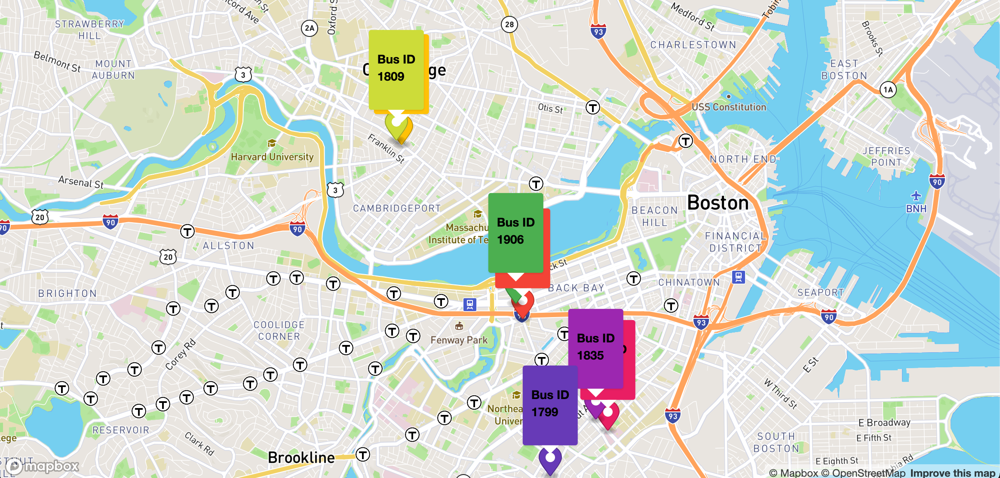

# Real Time Bus Tracker

## Project Description
The objective of this project is to display a map on a webpage that fetches the coordinates of all buses on the MBTA's route 1. This data is fetched from the MBTA's public API. Instead of displaying the same icon for every bus, the markers have a popup overhead that displays the bus number. Markers are easily differentiable because each popup is a different colour. Markers are erased and reloaded every 15 seconds with the latest bus locations. 

## How to Run
To run the tracker, begin by downloading this repository. Once installed, open index.html in a new browser tab. 

## Roadmap of Future Improvements
First, you can replace my mapbox token with your own by creating an account on mapbox.com. Future improvements can include a refresh button to bypass the 15 second timer. Also, pop-ups that are overlapping due to buses' close proximity can be clicked bringing the selected pop-up to the top for easy identification of these partially covered bus numbers. 

## License
MIT License

Permission is hereby granted, free of charge, to any person obtaining a copy of this software and associated documentation files (the "Software"), to deal in the Software without restriction, including without limitation the rights to use, copy, modify, merge, publish, distribute, sublicense, and/or sell copies of the Software, and to permit persons to whom the Software is furnished to do so, subject to the following conditions:

The above copyright notice and this permission notice shall be included in all copies or substantial portions of the Software.

THE SOFTWARE IS PROVIDED "AS IS", WITHOUT WARRANTY OF ANY KIND, EXPRESS OR IMPLIED, INCLUDING BUT NOT LIMITED TO THE WARRANTIES OF MERCHANTABILITY, FITNESS FOR A PARTICULAR PURPOSE AND NONINFRINGEMENT. IN NO EVENT SHALL THE AUTHORS OR COPYRIGHT HOLDERS BE LIABLE FOR ANY CLAIM, DAMAGES OR OTHER LIABILITY, WHETHER IN AN ACTION OF CONTRACT, TORT OR OTHERWISE, ARISING FROM, OUT OF OR IN CONNECTION WITH THE SOFTWARE OR THE USE OR OTHER DEALINGS IN THE SOFTWARE.
